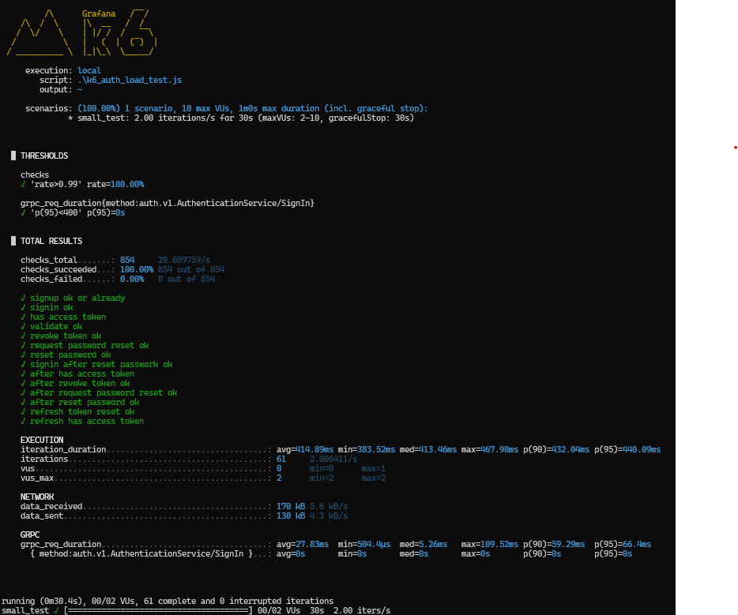
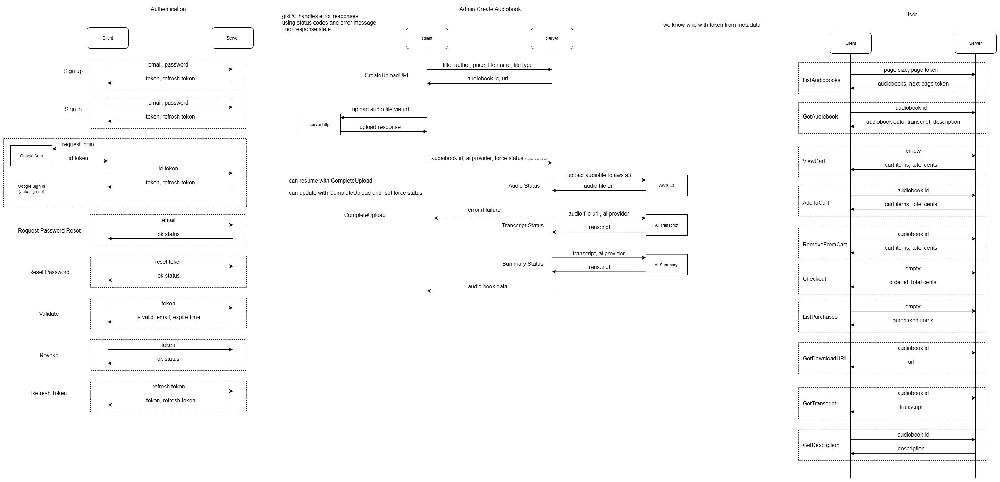
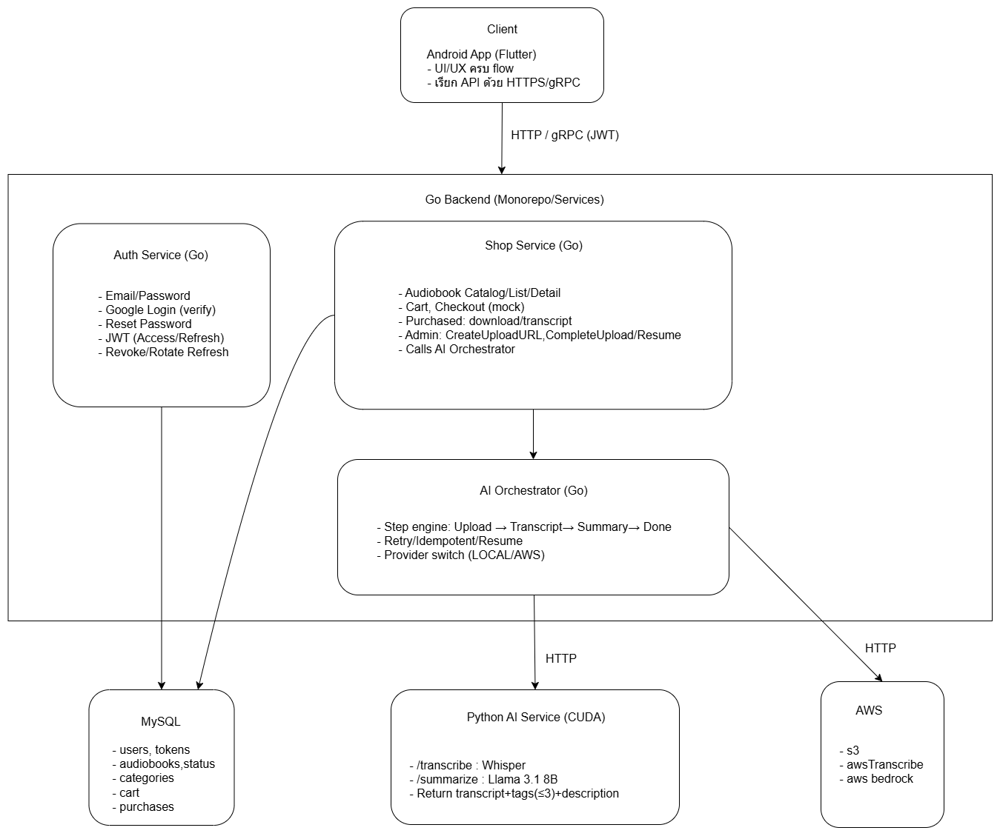

# SeniorFullStackEngineerTest
project for nexusai senior fullstack engineer

Tech Stack
    - Python: เหมาะกับงานที่ต้องใช้การประมวลผลสูงๆ อย่าง ai โดยเลือกมาใช้ในการจัดการ ai service โดยใช้ ทำ transcript โดยใช้ whisper  และ summary โดยใช้ llama3.1 8b
    - Golang: เหมาะกับงานที่ต้องการ concurrent สูงๆ ลองรับ load สูงๆ อย่าง backend services โดยเลือกมาใช้จัดการ authentication service  และ shop service
    - Flutter: เหมาะกับงาน frontend โดยเฉพาะกับทำงานระหว่าง android และ iOS ที่ต้องการ ui ที่หน้าตาเหมือนกัน ในการทำรอบเดียว เลือกมาใช้เป็น android client
    - MySQL: database ที่เลือกใช้ เหมาะกับการจัดการ transactions อย่าง ระบบ cart, checkout, purchase
    - อื่นๆ ก็มีใช้ gRPC, k6, docker 

Authentication System
    - มีระบบสมัครสมาชิกโดยใช้ google login และ email password
    - ระบบ email password สามารถ reset password ได้ hash password บน database
    - ใช้ JWT token ในการจัดการ interceptor บน gRPC 

Admin System
    - admin สามารถสร้าง audiobook ได้ โดยการ ตั้งชื่อ ตั้งราคา และเลือก audio file เพื่อ สร้าง audiobook 
    - ขั้นตอนจะเริ่มจาก upload ไปที่ server -> server upload ขึ้น cloud(s3) -> ai transcripts โหลด audio file จาก cloud มา processes -> หลังจากได้ transcripts, ai summary จะนำ transcripts มาจัด categories และ description -> บันถึกลง database
User System
    - สามารถเลือกซื้อ audiobooks ได้ โดยสามารถ filter category และ อ่าน description ก่อนตัดสินใจซื้อได้
    - สามารถกด add to cart เพื่อเพิ่มไปยังตะกร้าได้ โดยในตะกร้าสามารถลบ audiobook ได้ หากเปลี่ยนใจ
    - สามารถ checkout audiobooks ที่อยู่ใน cart ได้ โดยจะเป็นการ mockup ซึ่งจะ ซื้อสำเร็จเสมอ
    - หลังจากซื้อ audiobooks จะไปอยู่ในส่วน purchased ซึ่งในหน้านี้ user จะสามารถ download audio file หรือ กดดู transcript ของ audiobook ที่ซื้อมาแล้วได้

Screenshotted
    อยู่ใน folder Screenshots

Test Case System : test case จะ implement โดยใช้ go test ซึ่งเป็นระบบของ go
    Authentication test cases:
    - Sign-up and Sign-in : สร้าง user ใหม่ด้วยอีเมลสุ่ม + รหัสผ่านที่กำหนด -> เรียก sign-In ด้วยอีเมล/รหัสผ่านเดียวกัน
    - Sign-up Exist Email: sign-up ซ้ำด้วยอีเมลเดิม -> sign-up ครั้งที่สองด้วยอีเมลเดิมแต่รหัสต่างกัน
    - Password System: sign-in ด้วยรหัสผ่านผิด -> sign-up ผู้ใช้ใหม่ด้วยรหัสผ่านใหม่ -> Sign-in อีกครั้งด้วยด้วยรหัสผ่านที่ไม่ตรง
    - Refresh token: ทดสอบ refresh token แล้ว token เก่าจะต้องใช้ไม่ได้
    Validate token: ทดสอบ token ดีกับไม่ดี
    - Password reset flow: sign-up ผู้ใช้ใหม่ -> ขอ reset token จาก request password reset -> ลอง reset password ด้วย reset token ที่ไม่ถูก -> ลอง reset password ด้วย reset token ที่ถูกต้อง
    - Revoke Token: SignUp เสร็จแล้วสั่ง revoke token -> ลอง revoke token เดิมอีกครั้ง

    Shop test case:
    - Admin create & upload audiobook -> Admin force resume pipeline steps -> List audiobooks -> User add to cart & checkout -> User get download URL

Edge Case Handle
    หากในตอนที่กำลัง processes หลังจากเริ่มกดสร้าง audiobook ไม่ว่าจะจาก backend service หรือ ai service เราจะแบ่งขั้นตอนการ process เป็น step คือ upload -> transcript-> summary->done ถ้าหาก พังที่ step ไหน admin สามารถกลับมากด resume ในภายหลังได้ตลอด หรือแม้แต่ทำสำเร็จแล้ว แต่ description หรือ category ไม่ถูกใจ ก็สามารถกลับมาทำใหม่ได้ตลอด
    เราได้ทำระบบ ai provider ไว้ หากมีอันไหนมีปัญหา ก็สามารถสลับด้วยตัวเองแล้วทำงานต่อได้ทันที

Graceful handling
    หากมี process สร้าง audiobook ล้มเหลว จะขึ้นแจ้ง connection fail โดย admin สามารถกลับมากด resume ได้โดยง่าย โดยไม่จำเป็นต้องรู้ว่า ล้มเหลวที่จุดไหน แต่สามารถกด resume ได้ทันที ระบบจะจัดการต่อให้เอง

Requirement
    Nvidia Cuda, Cudnn
    Docker
    Make, Cmake
    k6

Setup Backend ,AI and Database
    - clone Project
    - set AWS_ACCESS_KEY_ID และ AWS_SECRET_ACCESS_KEY ใน docker-compose.yaml
    - run make deploy 
    - run make docker-go-test
    - run k6 run .\k6_auth_load_test.js 

APK URL : https://drive.google.com/file/d/1TviyhpphlJL0p4HhixVzP_kHiNNLV2Rg/view?usp=sharing

Simple K6 load test (authentication)

Live demo url: https://drive.google.com/file/d/1ctL6uNrs2W8iwfg2_BxI8O82BVl4cAfx/view?usp=sharing

Sequence Flow:

Architecture Diagrams:

